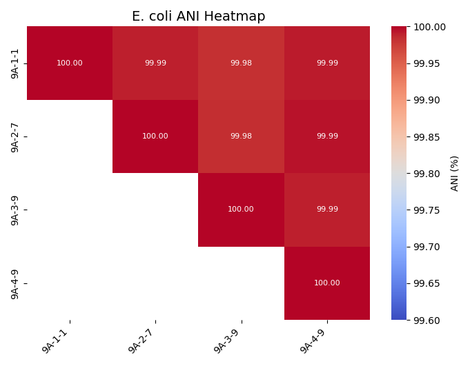

# ANI and SNP distance matrices

## Quick start

Here is my [code for producing ANI and SNP distance matrices](https://rngoodman.github.io/ANI-and-SNP-distances/ANI_and_SNP_distance_matrices.html) for 4 *E. coli* genomes. However, the same code can be applied to *n* bacterial genomes. 

## About 

[This tutorial](https://rngoodman.github.io/ANI-and-SNP-distances/ANI_and_SNP_distance_matrices.html) provides code for taking *n* genome sequences and running algorithms to determine average nucleotide identities (ANI) and core genome single nucleotide polymorphisms (SNPs), visualising the distances as heatmaps in python. It uses [fastANI](https://github.com/ParBLiSS/FastANI?tab=readme-ov-file) for ANI, [snippy](https://github.com/tseemann/snippy) and [snp-dists](https://github.com/tseemann/snp-dists) for SNP distances, and seaborn and matplotlib in python to visualise the distances as heatmaps.

ANI and SNP distance matrices are useful for comparing the relatedness of genomes. This is important in determining whether isolates are clonal in outbreaks or the relatedness of ancestor and progeny in evolution studies.

## What classes as clonal?

Determining ANI thresholds whereby two or more isolates are clonal or not clonal is a difficult task. 

[Rodriguez *et. al* (2024)](https://doi.org/10.1128/mbio.02696-23) analysed 18,123 genomes to determine where the thresholds lay which distinguished certain taxonomic ranks:

* same species - 95%
* same sequence type - 99.5%
* same strain - 99.9%

Yet these aren't always definitive thresholds, the gain of a large plasmid could lower the ANI <99.9% even though the chromosome would be identical. There can be lots of biological phenomena which can cause a clonal population to diverge such as:

* point mutations over time
* loss and gain of mobile genetic elements including plasmids
* homologous recombination 

The combination of ANI % and SNP distances provides more information about the differences between isolates which can help answer the question about clonality more fully. However, to more confidently determine clonality I would suggest further analyses such as:

* [Circular whole genome comparison](https://rngoodman.github.io/circular-genome-comparisons/circular_genome_comparisons.html)
* Phylogenetic analyses
* Multi-locus sequence typing (MLST)
* Species-specific typing
  + K and O types for *K. pneumoniae*
  + Clermon typing for *E. coli*
